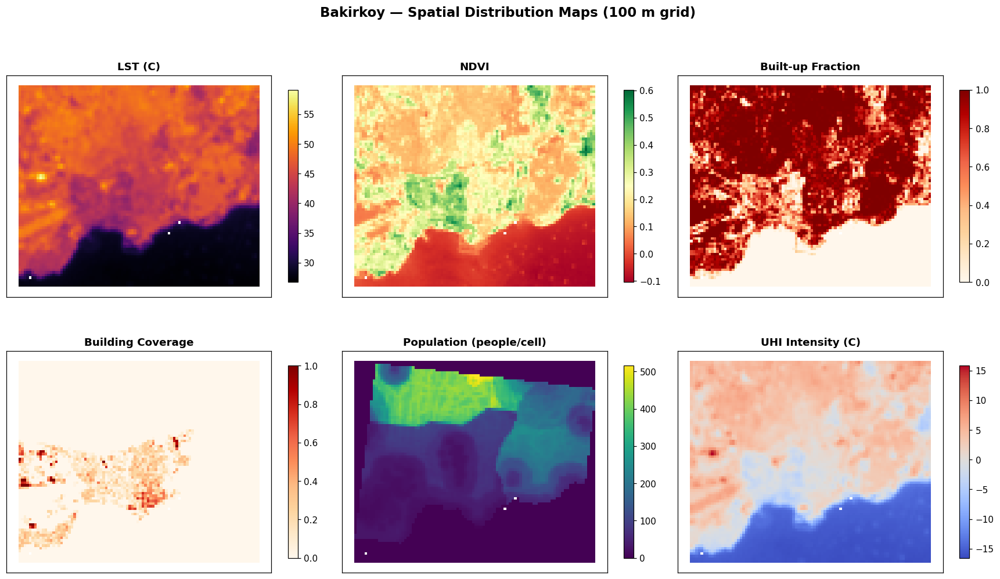
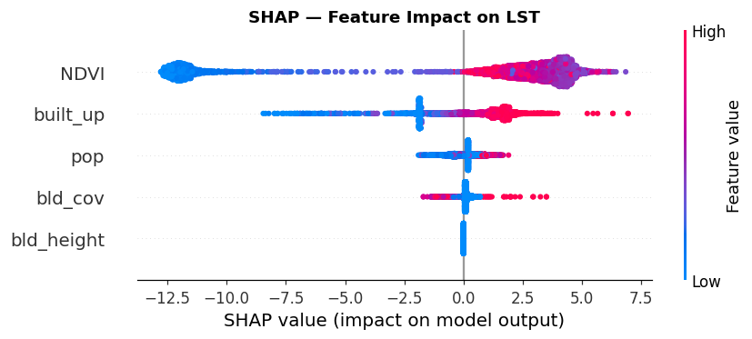

# Urban Heat Island (UHI) Intensity Prediction with GeoAI — Bakırköy, İstanbul

A multi-source GeoAI pipeline that predicts Urban Heat Island intensity in the
Bakırköy district of İstanbul by fusing satellite, land-cover, building and
population data, then explaining the model with SHAP and exposing the workflow
to an LLM via tool-calling.

> Study area: Bakırköy (~9.3 × 7.8 km) · Period: July 2023 · Grid: 100 m, EPSG:32637 (UTM 37N).

## Key results

| Finding | Value |
|---|---|
| Moran's I (LST) — spatial autocorrelation | **0.987** (p = 0.001) |
| Random CV R² vs Spatial CV R² | **0.96 → 0.51** (spatial leakage) |
| Dominant SHAP driver | **NDVI** (5.24 °C, cooling) |
| Buildings processed | 8,280 (OSM) |
| Analysis cells | 7,081 |

The collapse from R² 0.96 to 0.51 under spatial cross-validation is the central
result: with Moran's I ≈ 0.99, a random split leaks information between
neighbouring cells and grossly overstates accuracy.

## Data sources (all open-access)

| Layer | Source | Licence |
|---|---|---|
| Land Surface Temperature, NDVI | Landsat 8 (NASA/USGS) via Google Earth Engine | Public domain |
| Land cover (built-up fraction) | ESA WorldCover 2021 | CC BY 4.0 |
| Building footprints | OpenStreetMap | ODbL |
| Population density | WorldPop 2020 | CC BY 4.0 |

## Pipeline

| Script | Purpose |
|---|---|
| `01_download_data.py` | Download & clip all 5 layers |
| `02_data_pipeline.py` | Reproject/resample to a common grid, statistics, **Moran's I** |
| `03_model.py` | Random Forest, **random vs spatial CV**, **SHAP** |
| `04_tool_calling.py` | LLM (Gemini) **tool-calling** with 3 geo-tools |
| `05_web_map.py` | **Interactive Folium map** + static result maps |

## Setup

```bash
pip install -r requirements.txt
```

Two services need free credentials:

1. **Google Earth Engine** — register a free (noncommercial) Cloud project at
   <https://earthengine.google.com>, then `earthengine authenticate`. Set your
   project id in `01_download_data.py` / `04_tool_calling.py`.
2. **Google Gemini** (only for the tool-calling step) — get a free key at
   <https://aistudio.google.com/apikey> and place it in a `.env` file:
   ```
   GEMINI_API_KEY=your_key_here
   ```
   (`.env` is git-ignored. If the key is missing, the script falls back to a
   local rule-based orchestrator.)

## Run order

```bash
python 01_download_data.py     # downloads raw data (~minutes)
python 02_data_pipeline.py
python 03_model.py
python 04_tool_calling.py
python 05_web_map.py
```

## Outputs

- `outputs/figures/` — layer maps, Moran scatterplot, SHAP plots, result maps
- `outputs/maps/uhi_interactive_map.html` — interactive map (UHI / residuals / SHAP)




